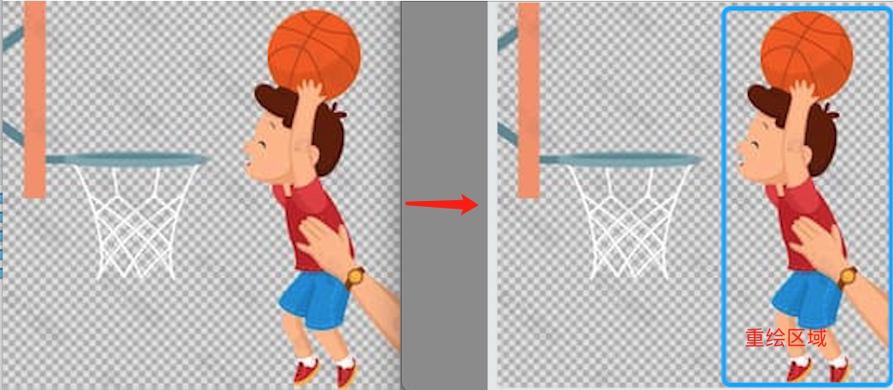
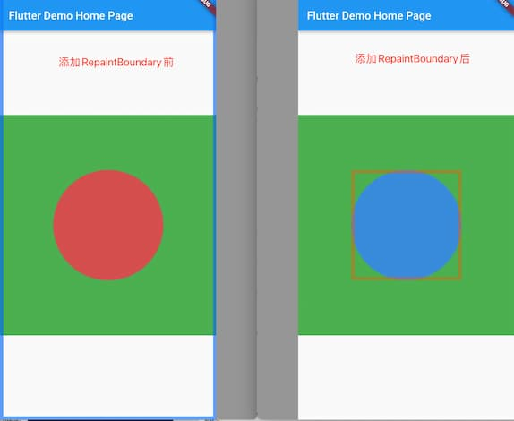
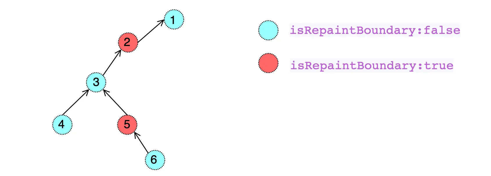

# 第2节：绘制边界

考虑下面左边这张小孩投篮的图片，在背景图像不变的情况下，要画出小孩投进篮球时的情景，我们需要将整张图片重新画一遍，还是将蓝色框面的人物擦除掉，然后在篮筐下面重新画出小孩投进篮球时的神态和表情？答案是显而易见的。



​										图一 画面的重绘区域

如果不是手绘的话，相信没有多少人会傻到将整张图的背景和人物都擦掉，然后重新打印，而是拷贝一张原图，在新图中将人物擦除掉，然后在篮筐下面绘制人物的新状态。图中的蓝色框对应就是flutter中的重绘区域边界RepaintBoundary。

考察下面这段代码
```dart
  Widget _buildBody() {
    return Stack(
      children: [
        Center(child: Container(color:Colors.green,width:400,height: 400,)),
        Center(
          child: CustomPaint(
              size: const Size.square(200),
              painter: MyPainter(factor: _colorAnimation),
          ),
        ),
      ],
    );
  }
}

class MyPainter extends CustomPainter {
  final Animation<Color?> factor;

  MyPainter({required this.factor}) : super(repaint: factor);

  @override
  void paint(Canvas canvas, Size size) {
    Paint paint = Paint()..color = factor.value ?? Colors.transparent;
    canvas.drawCircle(
        Offset(size.width / 2, size.height / 2), size.width / 2, paint);
  }

  @override
  bool shouldRepaint(covariant MyPainter oldDelegate) {
    return oldDelegate.factor != factor;
  }
}
```

绘制了一个静态正方形和一个动画圆形叠加的画面。调试的时候打开dev tool中的 flutter inspector 下的 Highlight Repaint选项，将会用举行标记处重绘区域。如下图左，然后在CustomPaint构造函数外包一层RepaintBoundary widget,重新运行，并打开Hightlight Repaint选项，可以发现包裹RepaintBoundary之后的重绘区域缩小为MyPainter动画的区域。



​											图二 圆形动画的重绘区域

是的，RepaintBoundary组件的作用就是缩小重绘区域，以见效性能消耗。

#### 具体重绘区域规则: 
从当前setState的那个statefulWidget对应的RenderObject开始，向上遍历父组件，遇到的第一个RepanintBoundary=ture组件为上界;向下遍历子组件，直到遇到RepanintBoundary=true的组件为下界。重绘区域就是上界与下界之间的RenderObject。如下图:


图三 重回区域的上界和下界

参考:https://cloud.tencent.com/developer/article/1775842


